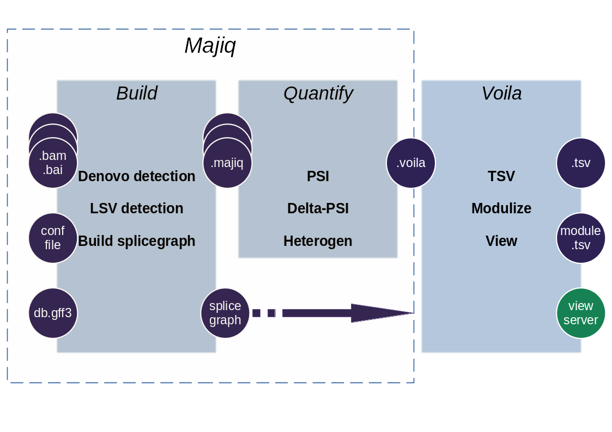

##############
Quick overview
##############

MAJIQ and Voila are two software packages that together define, quantify, and visualize local splicing variations (LSV) from RNA-Seq data. Conceptually, MAJIQ/Voila can be divided into three modules:

- MAJIQ Builder: Uses RNA-Seq (BAM files) and a transcriptome annotation file (GFF/GTF) to define splice graphs and known/novel Local Splice Variations (LSV).
- MAJIQ Quantifier: Quantifies relative abundance (PSI) of LSVs and changes in relative LSV abundance (delta PSI) between conditions with or without replicates. Used with one or more of the outputs from the builder.
- Voila: Different modes for converting the quantified results into human usable output. Can make TSV, Modulized, or Visual interactive output.

Prior to MAJIQ
--------------

You will need to process your sequences / trim / quality check / etc to create BAM files
along with their indexes (.bam.bai). There are a few possible options for this step. Options
we have found to work well include STAR_ and bbduk_.

In addition, you will need a gene annotation database in GFF3 format, for example, Ensembl_.

*Please make sure that the gene names from your annotation exactly match the gene names from your bamfiles.*

**General note**: in addition to the example below, you can find help composing your own commands + config by using the :ref:`command-builder`.

.. _MAJIQ Builder quick:

MAJIQ Builder
~~~~~~~~~~~~~

First, you will need to prepare the config file for your specific aligned experiments, you can find a sample config
template and more in depth instructions in :ref:`MAJIQ Builder full`. Here is a simple example of a build using
8 threads:

::

    $ majiq build  -c settings_file.ini annotation_database.gff3 -o /path/to/some/output/directory  -j 8

MAJIQ Quantifiers
-----------------

You may need to run quantifier once or more times depending on the number of comparisons you'd like to process.
Available modes are listed below.

Psi Quantifier
~~~~~~~~~~~~~~

::

    $ majiq psi -o /path/to/some/output/directory -n some_group_name /path/to/some/processed/experiment.majiq

Deltapsi Quantifier (replicate experiments)
~~~~~~~~~~~~~~~~~~~~~~~~~~~~~~~~~~~~~~~~~~~

::

    $ majiq deltapsi -o /path/to/some/output/directory -n group_name_1 group_name_2 -grp1 /some/experiment1.majiq /some/experiment2.majiq -grp2 /some/experiment3.majiq /some/experiment4.majiq

Heterogen Quantifier (independent experiments)
~~~~~~~~~~~~~~~~~~~~~~~~~~~~~~~~~~~~~~~~~~~~~~

::

    $ majiq heterogen -o /output/directory -n group_name_1 group_name_2 -grp1 /some/experiment1.majiq -grp2 /some/experiment2.majiq
    $ majiq heterogen -o /output/directory -n group_name_3 group_name_4 -grp1 /some/experiment3.majiq -grp2 /some/experiment4.majiq
    $ majiq heterogen -o /output/directory -n group_name_5 group_name_6 -grp1 /some/experiment5.majiq -grp2 /some/experiment6.majiq

Analysis with VOILA
-------------------

::

    $ voila view -p 5000 /path/to/splicegraph.sql /path/to/voila/files
    $ voila tsv -f /path/to/output/tsv /path/to/splicegraph.sql /path/to/voila/files -j8
    $ voila modulize -d /path/to/output/directory /path/to/splicegraph.sql /path/to/voila/files -j8

Note: different voila modes support different combinations of voila files:

    * voila view can take one or multiple PSI files (single or multiple, independent PSI), one DPSI file, or one or more HET files.
    * voila tsv may only take one PSI file, one DPSI file, or one or more HET files
    * voila modulize may take any number or combination of PSI, DPSI, and/or HET files.

.. _STAR: https://github.com/alexdobin/STAR
.. _bbduk: https://jgi.doe.gov/data-and-tools/bbtools/bb-tools-user-guide/bbduk-guide/
.. _Ensembl: https://useast.ensembl.org/info/data/ftp/index.html