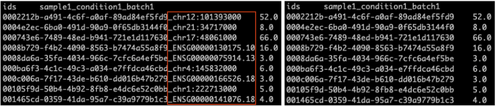

###############
MAJIQ-L
###############

MAJIQ-L takes an input three sources of information: Transcriptome annotation; short reads processed by MAJIQ v2; and long reads in gtf format, processed by the user’s algorithm of choice. It then computes and displays an extensive set of statistics that contrast the available annotation and the two sequencing sources in terms of novel junctions, introns, coverage, inclusion levels, etc. such that existing gaps between the three sources can be captured

Using the three input sources, MAJIQ-L constructs unified gene splice graphs with all isoforms and all LSVs visible for analysis. This unified view is implemented in a new visualization package (VOILA v3), allowing users to inspect each gene of interest where the three sources agree or differ.

VOILA lr: Unified Visualization
-------------------------------

VOILA lr takes four inputs:

1. A splicegraph database (splicegraph.sql from MAJIQ Builder)
2. Voila files (SAMPLE_ID.psi.voila from MAJIQ quantifiers)
3. Long reads in gtf format, processed by the user’s algorithm of choice
4. A SAMPLE_ID.tsv, a tab separated file, containing transcript read number processed by the user’s algorithm of choice like:

    | transcript_id_1       transcript_read_1
    | transcript_id_2       transcript_read_2
    | transcript_id_3       transcript_read_3

For example, use the following command options:

+------------------------------------------------------------+
| | voila lr                                                 |
| | --lr-gtf-file /PAHT/TO/SAMPLE_ID.gtf                     |
| | --lr-tsv-file /PAHT/TO/SAMPLE_ID.tsv                     |
| | -sg /PATH/TO/splicegraph.sql                             |
| | -o OUTPUT_FOLDER                                         |
|                                                            |
| Default: 1                                                 |
+------------------------------------------------------------+

Output is the resulting long read voila file (recommended extension in .lr.voila format)

To display the unified splicegraph, the output of voila lr (SAMPLE_ID.lr.voila) is given as input to `VOILA v3 <https://biociphers.bitbucket.io/majiq/VOILA_view.html>`_. Users may use voila view as a server to display results as shown `here <https://biociphers.bitbucket.io/majiq/VOILA_view_server.html>`_. For example, use the following command options:

+------------------------------------------------------------+
| | voila view                                               |
| | /PATH/TO/splicegraph.sql                                 |
| | /PAHT/TO/SAMPLE_ID.psi.voila                             |
| | /PATH/TO/SAMPLE_ID.lr.voila                              |
| | -p 7050                                                  |
| | --host 0.0.0.0                                           |
|                                                            |
| Default: 1                                                 |
+------------------------------------------------------------+

Additional details on usage can be found by adding --help to the subcommand of interest (e.g. voila view --help)

Examples of obtaining GTF and TSV files from different LR algorithms
====================================================================

Using `IsoQuant <https://github.com/ablab/IsoQuant>`_:

- **GTF file**: Obtain the GTF file containing the discovered expressed transcripts (``SAMPLE_ID.transcript_models.gtf`` should be provided) by running `IsoQuant <https://github.com/ablab/IsoQuant?tab=readme-ov-file#sec3.3:~:text=Transcript%20discovery%20output>`_.

  - **TSV file**: Obtain the TSV file with read counts assigned to each transcript (``SAMPLE_ID.transcript_model_counts.tsv`` should be provided) by running `IsoQuant <https://github.com/ablab/IsoQuant?tab=readme-ov-file#sec3.3:~:text=Transcript%20discovery%20output>`_.

  Using `FLAIR <https://flair.readthedocs.io/en/latest/>`_:

  - **GTF file**: Obtain the GTF file containing the discovered expressed transcripts from the `flair collapse <https://flair.readthedocs.io/en/latest/modules.html#flair-collapse>`_ step.

  - **TSV file**: Obtain the TSV file with read counts assigned to each transcript from the `flair quantify <https://flair.readthedocs.io/en/latest/modules.html#flair-quantify>`_ step. The output of ``flair quantify`` looks like the screenshot on the left below. You need to modify this file by removing the gene_id after the last underscore in the transcript IDs to match the format shown in the screenshot on the right. This modified TSV file should be provided as your input TSV file.

MAJIQ-L: short and long reads junction comparison/contrast
----------------------------------------------------------

MAJIQ-L takes a splicegraph database (``splicegraph.sql`` from `MAJIQ Builder <https://biociphers.bitbucket.io/majiq/MAJIQ.html#builder>`_) and long reads files in ``.lr.voila`` format, processed by VOILA lr.

For example, use the following command options:

+------------------------------------------------------------+
| | python majiql.py                                         |
| | --lr-voila-file /PATH/TO/SAMPLE_ID.lr.voila              |
| | --splicegraph /PATH/TO/splicegraph.sql                   |
| | --output OUTPUT_FOLDER                                   |
|                                                            |
| Default: 1                                                 |
+------------------------------------------------------------+

There are two TSV file outputs. The first TSV file, specified by the --output argument, contains the number of junctions assigned to each source of information for each gene. Additionally, the script automatically generates a second TSV file, which ends with _total.tsv. This second file contains the total number of junctions per source of information across all genes, and does not require a separate argument.

Arguments
---------

MAJIQ-L
-------

    usage: majiql.py [-h] --lr-voila-file LR_VOILA_FILE --splicegraph SPLICEGRAPH --output OUTPUT
                     [--fuzziness5 FUZZINESS5] [--fuzziness3 FUZZINESS3] [--only-junctions]

    Obtain raw counts of junctions of overlapping existance between long and short reads. This tool does not take
    read counts or quantifications into account, only existing or non-existing junctions.

    options:
      -h, --help            show this help message and exit
      --lr-voila-file LR_VOILA_FILE
                            Path to the .lr.voila processed long reads file
      --splicegraph SPLICEGRAPH
                            Path to the short read MAJIQ splicegraph file (.sql)
      --output OUTPUT       Path to the the tsv file to write counts
      --fuzziness5 FUZZINESS5
                            5 prime fuzziness of long-read sequencing (number of basepairs)
      --fuzziness3 FUZZINESS3
                            3 prime fuzziness of long-read sequencing (number of basepairs)
      --only-junctions      Only include junctions in the analysis, not introns

VOILA lr
--------

    usage: voila lr [-h] [--voila-file VOILA_FILE] [--gene-id GENE_ID]
                    [--only-update-psi] [--lr-gtf-file LR_GTF_FILE]
                    [--lr-tsv-file LR_TSV_FILE] -o OUTPUT_FILE
                    [-sg SPLICE_GRAPH_FILE] [-j NPROC] [--debug] [--memory-map-hdf5]

    optional arguments:
      -h, --help            show this help message and exit
      --voila-file VOILA_FILE
                            This should be a .psi.voila file which we will match LSV
                            definitions to to run the beta prior. If not provided,
                            PSI values will not be rendered for long read LSVs
      --gene-id GENE_ID     Limit to a gene-id for testing
      --only-update-psi     Instead of re generating all data, only update the PSI
                            values. Requires -o to point to an existing .lr.voila
                            file, and --voila-file to be provided as well
      -j NPROC, --nproc NPROC
                            Number of processes used to produce output. Default is
                            half of system processes.
      --debug               Show Verbose output
      --memory-map-hdf5     by default, hdf5 voila files will be opened and read as
                            needed, however, for greater performance it may help to
                            instead preload these files into memory, if your server
                            has sufficient RAM. Use this option to memory map the
                            files. If used with view mode, you must also specify an
                            index file to save to with --index-file
      -l LOGGER, --logger LOGGER
                            Set log file and location. There will be no log file if
                            not set.
      --silent              Do not write logs to standard out.

    required named arguments:
      --lr-gtf-file LR_GTF_FILE
                            path to the long read GTF file
      --lr-tsv-file LR_TSV_FILE
                            path to the long read TSV file
      -o OUTPUT_FILE, --output-file OUTPUT_FILE
                            the path to write the resulting voila file to
                            (recommended extension .lr.voila)
      -sg SPLICE_GRAPH_FILE, --splice-graph-file SPLICE_GRAPH_FILE
                            the path to the majiq splice graph file which will be
                            used to align to annotated exons

Citation
--------

The paper describing MAJIQ-L algorithm is available at https://www.biorxiv.org/content/10.1101/2023.11.21.568046v1.